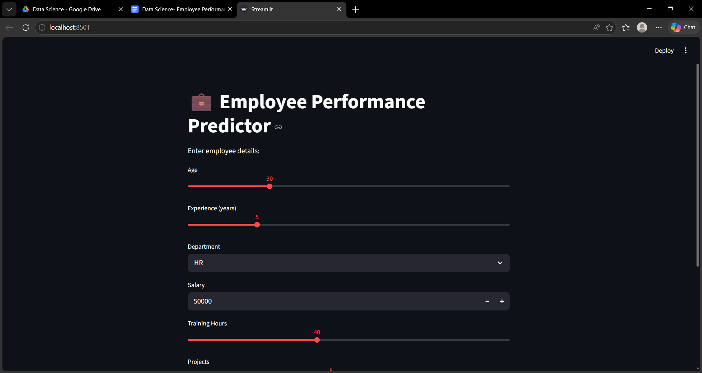
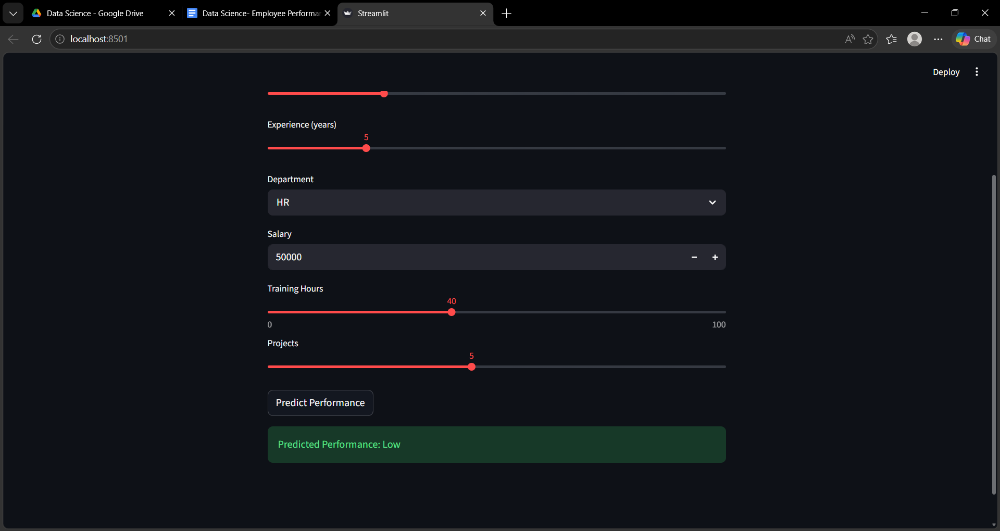
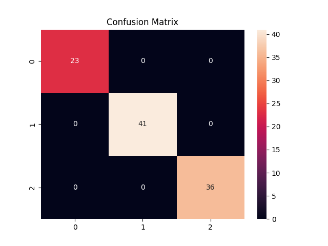
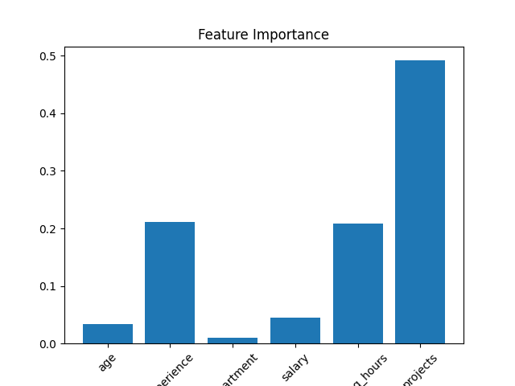
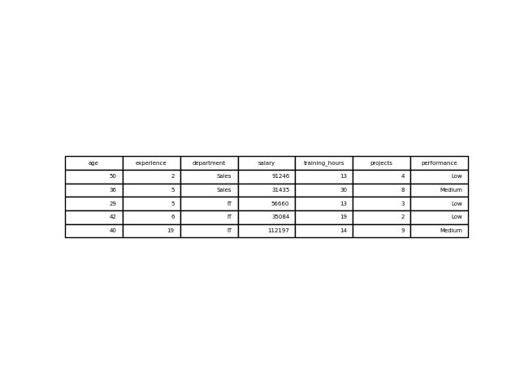

# Updated README 🚀
# 💼 Employee Performance Predictor using Data Analytics

## 🚀 Project Overview

This project predicts employee performance (High / Medium / Low) using Machine Learning and provides HR insights with a Streamlit dashboard.

---

## 🎯 Problem Statement

Organizations need a data-driven way to evaluate employee performance and improve decision-making.

---

## 🧠 Business Value

* Identify high performers
* Detect low performers early
* Improve training strategies
* Support promotions & retention

---

## 🏗 Architecture

```
Employee Data → Preprocessing → ML Model → Prediction → Dashboard
```

---

## 🛠 Tech Stack

* Python
* Pandas, NumPy
* Scikit-learn
* Matplotlib, Seaborn
* Streamlit

---

## 🖥 Dashboard Preview




---

## 📊 Model Results

### Confusion Matrix



### Feature Importance



---

## 📂 Dataset Preview



---

## ▶️ How to Run

```bash
pip install -r requirements.txt
python main.py
streamlit run app/app.py
```

---

## 📁 Folder Structure

```
Employee-Performance-Predictor/
├── data/
├── src/
├── models/
├── outputs/
├── images/
├── app/
├── main.py
├── README.md
```

---

## 👩‍💻 Author

Sanskritika Awasthi
